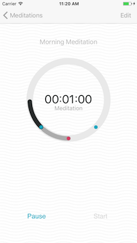
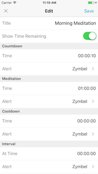

# Lotus Meditation Timer

## Description

Lotus timer is a simple meditation timer with integrated countdown, meditation, cooldown, and interval features. Users are able to store multiple different timers on their phone as well as customize tones, and start, pause, resume, and restart timers. 

Future iterations will (hopefully) include: 
* Better documentation :(
* Better application state-saving abilities
* Calendar/Tracking functionality with alerts
* More alert sounds
* More customizable UI

... and more!

## Build

Built with Swift and love :)

## Screen Shots

